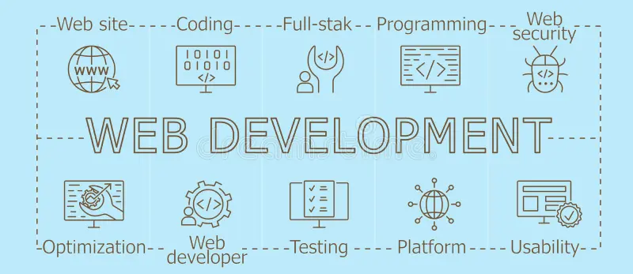

  

 
<h1 align="center">Hi 👋, I'm Mahesh Mali</h1>
<h3 align="center">A passionate Full Stack Developer from Pune, India</h3>

- 💬 Ask me about : **Data structures and Algorithms,TypeScript, Node.js and NestJS**

- 📫 How to reach me : **mahimali15082001@gmail.com**

- 📄 Know about my experiences : [Resume Link](https://drive.google.com/file/d/1cfMSD7vdNWF5oHSn8axirNMuMbW7dC6Y/view?usp=sharing)

- 👯 I’m looking to collaborate on Open source MEAN Projects.

- ⚡ Fun fact : **It’s not a bug — it’s an undocumented feature.**
   
  

  <h2> My GitHub Stats</h2>
  <table align="center" style="width: 100%;">
    <tr>
      <td>
        
      </td>
      <td>
        
      </td>                           
    </tr>
  </table>
  

  <table>
    <tr>
      <td>
        
      </td>
    </tr>
  </table>
  

  <table align="center" >
    <tr >
      <td align="center">
    
  </td>
  <td align="center">
    
  </td>

    </tr>
  </table>

<h2 align="center"> Connect with me </h2>
 
<table style="width: 100%;" align="center">
    <tr align="center">
    <td align="center">

</td>
    </tr>
</table>
 

<h2 align="center"> Skills </h2>

  <table style="width: 100%;" align="center">
    <tr align="center">
      <td align="center"><h3>Programming Languages</h3>
      
  
   </a>  
   

      </td>
      <td align="center">
        <h3>Front-End Development</h3>
  
     <a  style="display: inline-block; margin: 2%;" href="https://reactjs.org/" target="_blank" rel="noreferrer">  

      </td>
      <td align="center">
        <h3>Back-End Development</h3></a> 
        

      </td>
    </tr>
    <tr>
      <td align="center">
        <h3>Databases: </h3>
  
  

      </td>
      <td align="center">
        <h3>Software</h3>
  
     

      </td>
      <td align="center">
        <h3>Others:</h3>
  
  
   

      </td>
    </tr>
   </table>

<!-- GitHub Profile Trophy -->
<h2 align="center">GitHub Profile Trophies</h2>
 

  

 <h2 align="center"> Thank you for visiting my profile </h2>     
                                                                                                                   
 <table align="center">
        <tr>
             <td><h3> Visitors: </h3></td>
             <td></td>                                                                     
        </tr>                                                                                             
 </table>

