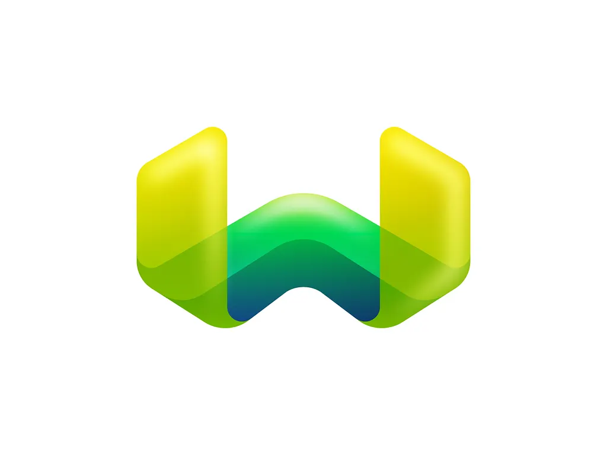
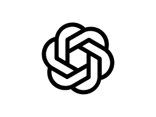

# Mahesh Mali

<em>Building intelligent, observable, and scalable systems — one layer at a time.</em>

<table width="100%">
  <tr>
    <td valign="top" width="60%">
      <h2>SDE-2 · Multi-Agent AI • MEAN • Observability</h2>
      
Senior software engineer building backend & distributed systems for autonomous operations

      

        &nbsp;&nbsp;
        
        &nbsp;&nbsp;
        
      

      

        &nbsp;
        &nbsp;
        
      

    </td>
    <td align="center" width="40%">
      
    </td>
  </tr>
</table>

## 👨‍💻 About

SDE-2 focused on multi-agent AI, observability, and low-latency microservices. Designing and hardening systems for enterprise drone ops.

**Highlights:** Multi-agent Ops • Speaker @ Commercial UAV Expo • 500+ DSA solved • SSoC Open Source

<table>
  <tr>
    <td>
      <strong>Current Focus</strong>
      <ul>
        <li>Multi-agent operational intelligence platform</li>
        <li>Agentic QA automation (−80% test time)</li>
        <li>Low-latency schedulers & streaming (RabbitMQ/EMQX)</li>
        <li>LangChain / LangGraph integrations for operational intelligence</li>
      </ul>
    </td>
    <td>
      <strong>What I ship</strong>
      <ul>
        <li>Reliable platform layers and agentic workflows</li>
        <li>AI-native tooling that reduces manual ops</li>
        <li>Observability-first microservices</li>
        <li>Cost-aware, scalable backend services</li>
      </ul>
    </td>
  </tr>
</table>

---

## 🛠️ Tech Stack

**Languages**

&nbsp;&nbsp;&nbsp;&nbsp;&nbsp;&nbsp;&nbsp;&nbsp;&nbsp;&nbsp;&nbsp;&nbsp;&nbsp;&nbsp;&nbsp;&nbsp;

**Frontend**

&nbsp;&nbsp;&nbsp;&nbsp;&nbsp;&nbsp;&nbsp;&nbsp;&nbsp;&nbsp;&nbsp;&nbsp;&nbsp;&nbsp;&nbsp;&nbsp;

**Backend & APIs**

&nbsp;&nbsp;&nbsp;&nbsp;&nbsp;&nbsp;&nbsp;&nbsp;&nbsp;&nbsp;&nbsp;&nbsp;

**Datastores**

&nbsp;&nbsp;&nbsp;&nbsp;&nbsp;&nbsp;&nbsp;&nbsp;&nbsp;&nbsp;&nbsp;&nbsp;

**AI & Agentic**

&nbsp;&nbsp;&nbsp;&nbsp; &nbsp;&nbsp;&nbsp;&nbsp; &nbsp;&nbsp;&nbsp;&nbsp; &nbsp;&nbsp;&nbsp;&nbsp;

**DevOps & Infra**

&nbsp;&nbsp;&nbsp;&nbsp;&nbsp;&nbsp;&nbsp;&nbsp;&nbsp;&nbsp;&nbsp;&nbsp;&nbsp;&nbsp;&nbsp;&nbsp;&nbsp;&nbsp;&nbsp;&nbsp;

## 📊 GitHub Analytics

<table>
  <tr>
    <td align="center">
      
    </td>
    <td align="center">
      
    </td>
  </tr>
</table>

  

## 🚀 Featured Projects

**🧠 [Code Connoisseur](https://github.com/Maheshmali1/code-connoisseur)** — AI-powered agentic code review

- 6+ analysis layers
- semantic retrieval + multi-agent orchestration; CLI-first.
- Stack: Python, LangChain, OpenAI, FastAPI.

**🛸 Multi-Agent Intelligence (FlytBase)** — Real-time mission analytics

- Multi-agent report generation, live video analytics;
- alert streaming with vector DB.
- Stack: LangGraph, Weaviate, FastAPI, Vector DB.

**🧑‍💼 [Employee Management System (Server)](https://github.com/Maheshmali1/Employee_Management_System_APIs)** — RESTful backend with RBAC

- Type-safe modular API (Node.js/Express/TypeScript);
- Role-based supervisor authorization via middleware; secure access control.
- Quality & docs: Jest, ESLint, Swagger UI.

---

## 🤝 Connect

&nbsp;&nbsp;
&nbsp;&nbsp;
&nbsp;&nbsp;
&nbsp;&nbsp;
&nbsp;&nbsp;

